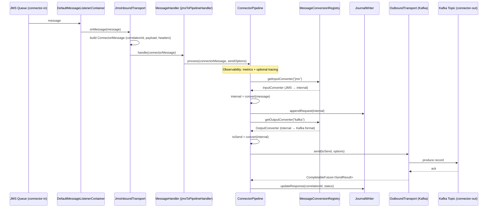
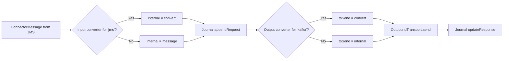
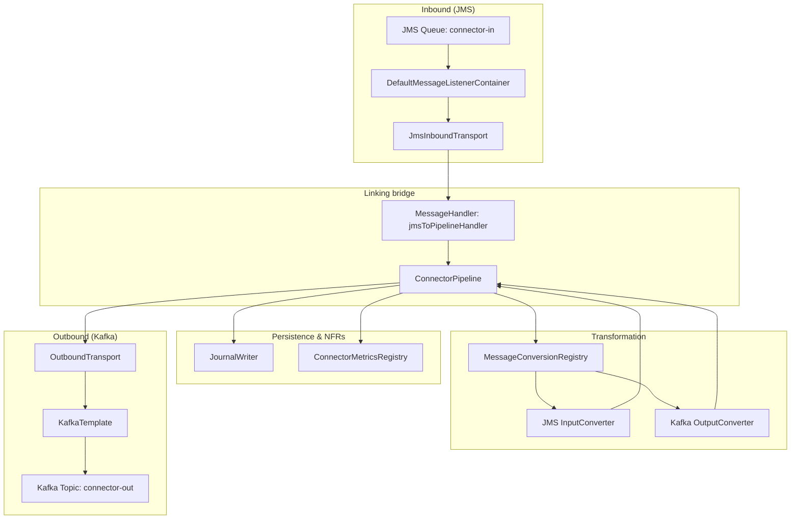

# JMS → Kafka Demo: Flow and Architecture

This document describes where **transformation** (input/output message format translation) happens and where the **linking bridge** (JMS consumption → pipeline → Kafka publication) is wired. It applies to the **connector-demo-jms-kafka** application.

---

## 1. High-level flow

```
┌─────────────┐     ┌──────────────────────────────────────────────────────────┐     ┌─────────────┐
│  JMS Queue  │────▶│  Connector Pipeline (transform, journal, observability)  │────▶│   Kafka     │
│ connector-in│     │  + Linking bridge (MessageHandler → Pipeline → Outbound)  │     │ connector-out│
└─────────────┘     └──────────────────────────────────────────────────────────┘     └─────────────┘
```

End-to-end:

1. A message is **consumed from JMS** (queue `connector-in`).
2. It is turned into a **ConnectorMessage** and passed to the **pipeline** via the **MessageHandler** (the bridge).
3. The pipeline runs **input conversion** (JMS format → internal), **journals** the request, runs **output conversion** (internal → Kafka format), then **sends** to Kafka via the outbound transport.
4. The **response** (success/failure) is journalled.

---

## 2. Flow diagram (detailed)



---

## 3. Where is the linking bridge?

The **bridge** is the chain that connects “JMS message consumed” to “Kafka message published”.

| Step | Component | Role |
|------|-----------|------|
| 1 | **DefaultMessageListenerContainer** | Listens to JMS queue `connector-in`; on each message calls `MessageListener.onMessage()`. |
| 2 | **JmsInboundTransport** | Implements `MessageListener`. Builds a **ConnectorMessage** from the JMS message (payload, headers, correlation ID) and calls **MessageHandler.handle(message)**. |
| 3 | **MessageHandler (jmsToPipelineHandler)** | The bridge bean: `message -> pipeline.process(message, Map.of("topic", "connector-out"))`. Connects inbound to pipeline. |
| 4 | **ConnectorPipeline** | Runs conversion (input → journal → output), then calls **OutboundTransport.send(toSend, options)**. |
| 5 | **OutboundTransport (Kafka)** | Implemented by **KafkaOutboundTransport** (wrapped by **ResilientKafkaOutboundTransport**). Sends **ConnectorMessage** payload to Kafka topic `connector-out`. |

**Code locations (demo):**

- **Bridge wiring:** `DemoJmsKafkaConfiguration`:
  - `jmsListenerContainer(..., JmsInboundTransport jmsInboundTransport)` — container’s listener is the JMS transport.
  - `jmsToPipelineHandler(ConnectorPipeline pipeline)` — handler that calls `pipeline.process(...)`.
  - `WireJmsHandler` — sets `jmsInboundTransport.setMessageHandler(jmsToPipelineHandler)` so every JMS message goes into the pipeline.
- **Pipeline → Kafka:** same config: `connectorPipeline(...)` receives `OutboundTransport kafkaOutboundTransport` and uses it in `process()` to send.

So: **JMS → JmsInboundTransport → MessageHandler → ConnectorPipeline → OutboundTransport (Kafka)** is the linking bridge.

---

## 4. Where is the transformation (input/output format translation)?

Transformation is **input conversion** (JMS format → internal) and **output conversion** (internal → Kafka format). It is performed **inside ConnectorPipeline** using **MessageConversionRegistry**.

### 4.1 Pipeline flow (with conversion)



### 4.2 Where converters are defined and used

| Layer | What | Where |
|-------|------|--------|
| **Registry** | Holds input/output converters per transport | **MessageConversionRegistry** (connector-transformation). |
| **Invocation** | Pipeline calls registry and runs converters | **ConnectorPipeline.process()** (connector-transformation): `getInputConverter(transport)`, `getOutputConverter(outputTransport)`. |
| **Demo implementation** | JMS → internal, internal → Kafka | **JmsToKafkaTransformation** (connector-demo-jms-kafka): registers **InputConverter&lt;ConnectorMessage&gt;** for `"jms"` and **OutputConverter&lt;ConnectorMessage&gt;** for `"kafka"` on the shared **MessageConversionRegistry** bean. |

### 4.3 Demo transformation behaviour

- **Input (JMS):** Decode payload as UTF-8, trim. Result is the “internal” **ConnectorMessage** (same structure, normalized payload).
- **Output (Kafka):** Take internal message, prefix payload with `"[JMS→Kafka] "`, build a new **ConnectorMessage** with `transportType = "kafka"`. That message is what gets sent to Kafka.

So: **transformation** = input converter (JMS → internal) + output converter (internal → Kafka format), both applied inside the pipeline and registered in **JmsToKafkaTransformation**.

---

## 5. Component diagram



---

## 6. Summary table

| Question | Answer |
|----------|--------|
| **Where is the transformation (input → output format)?** | In **ConnectorPipeline.process()**: it uses **MessageConversionRegistry** to run an optional **input** converter (JMS → internal) and an optional **output** converter (internal → Kafka). Demo converters are registered in **JmsToKafkaTransformation**. |
| **Where is the linking bridge (JMS consumed → Kafka published)?** | **DefaultMessageListenerContainer** (listens to JMS) → **JmsInboundTransport.onMessage()** (builds ConnectorMessage) → **MessageHandler** (jmsToPipelineHandler) → **ConnectorPipeline.process()** → **OutboundTransport.send()** (Kafka). Wiring is in **DemoJmsKafkaConfiguration** (container, handler, and `WireJmsHandler`). |
| **How to see transformation in the demo?** | Send a JMS message (e.g. via `POST /demo/send` with body `hello`). Consume from Kafka topic `connector-out`: the value should be **`[JMS→Kafka] hello`** (output converter prefix). |

---

## 7. References

- **Pipeline:** `connector-transformation/ConnectorPipeline.java`
- **Registry:** `connector-transformation/MessageConversionRegistry.java`
- **Demo config (bridge + pipeline):** `connector-demo-jms-kafka/DemoJmsKafkaConfiguration.java`
- **Demo transformation (converters):** `connector-demo-jms-kafka/JmsToKafkaTransformation.java`
- **Demo README:** `connector-demo-jms-kafka/README.md`
