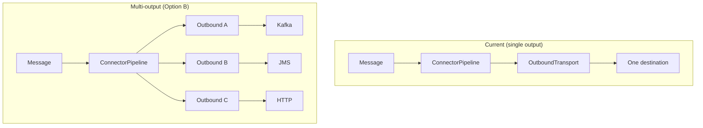

# Multiple Inputs and Multiple Outputs: Current Design and Bottlenecks

This document answers whether the connector framework allows **multiple inputs** and **multiple outputs** in the same process, and where the bottlenecks are if not.

---

## 1. Short answer

| Scenario | Supported? | Notes |
|----------|------------|--------|
| **Multiple inputs** (e.g. HTTP + JMS + Kafka in same process) | **Yes** | Each inbound transport can be registered and wired to the same or different handler(s). Input conversion is per transport type. |
| **Multiple outputs** (e.g. send same message to Kafka and JMS) | **No** | The pipeline has a single outbound transport and a single output converter; journal and replay are single-destination. |

---

## 2. Multiple inputs: how it works today

Multiple inbound transports in the same process are already supported.

- **Actuator:** `ConnectorControlEndpoint` and composite health aggregate **all** registered `TransportRegistration` beans (HTTP, JMS, Kafka, gRPC). Each can be started/stopped independently.
- **Wiring:** Each `InboundTransport` has `setMessageHandler(MessageHandler)`. You can set the **same** handler on multiple transports so that HTTP, JMS, and Kafka all feed the same pipeline:

```text
HttpInboundTransport  ──┐
JmsInboundTransport   ──┼──▶  MessageHandler  ──▶  ConnectorPipeline.process()
KafkaInboundTransport ──┘
```

- **Input conversion:** `ConnectorPipeline.process()` looks up the input converter by `message.transportType()` (e.g. `"http"`, `"jms"`, `"kafka"`). So you can register different input converters per transport type in `MessageConversionRegistry`.
- **No structural bottleneck:** There is no single “one inbound only” constraint; the limit is how you wire handlers and register converters.

**Conclusion:** Multiple inputs are supported. No design change required for “multiple inputs in the same process.”

---

## 3. Different input / transform / output combinations (routing)

**Yes.** You can run **different routes** in the same process, e.g.:

- **Route 1:** JMS → transform A → Kafka  
- **Route 2:** HTTP → transform B → JMS  
- **Route 3:** Kafka → transform C → HTTP  

Each route is a different **input → pipeline (transform) → output** combination.

### How it works

1. **One pipeline per output (or per route).**  
   Each pipeline has a single outbound and a single `outputTransport` name. So you define e.g.:
   - `pipelineJmsToKafka`: outbound = Kafka, `outputTransport = "kafka"`
   - `pipelineHttpToJms`: outbound = JMS, `outputTransport = "jms"`

2. **Wire each inbound to the pipeline you want.**  
   Each inbound has one `MessageHandler`. Point it at the pipeline that should handle that input for that route:
   - `JmsInboundTransport.setMessageHandler(msg -> pipelineJmsToKafka.process(msg, kafkaOptions))`
   - `HttpInboundTransport.setMessageHandler(msg -> pipelineHttpToJms.process(msg, jmsOptions))`

3. **One shared registry, keyed by transport.**  
   - **Input conversion:** chosen by `message.transportType()` (e.g. `"jms"`, `"http"`). Register e.g. `registerInput("jms", ...)`, `registerInput("http", ...)` so each route gets the right input transform.  
   - **Output conversion:** chosen by each pipeline’s `outputTransport` (e.g. `"kafka"`, `"jms"`). Register e.g. `registerOutput("kafka", ...)`, `registerOutput("jms", ...)` so each route gets the right output transform.

So **different input/transform/output combinations** = multiple pipelines (one per output) + wire each inbound to the handler that calls the correct pipeline. The registry supplies the right input and output converters per transport.

### Diagram

```text
JMS  ──▶ handler1 ──▶ pipeline1 (outputTransport=kafka) ──▶ Kafka   [input conv "jms", output conv "kafka"]
HTTP ──▶ handler2 ──▶ pipeline2 (outputTransport=jms)  ──▶ JMS     [input conv "http", output conv "jms"]
Kafka ──▶ handler3 ──▶ pipeline3 (outputTransport=http) ──▶ HTTP   [input conv "kafka", output conv "http"]
```

All three can share one `MessageConversionRegistry` (with all six converters registered) and one `JournalWriter` if you want a single journal.

### Same input type, different outputs (content-based routing)

If the **same** transport (e.g. JMS) should go to **different** outputs depending on message content or headers (e.g. topic A vs topic B, or Kafka vs JMS), you have two options:

- **Handler-level routing:** Use one handler for JMS that inspects the message (headers, payload, or content type) and calls the appropriate pipeline:  
  `msg -> { if (isTypeA(msg)) pipelineToKafka.process(msg, ...); else pipelineToJms.process(msg, ...); }`
- **Finer-grained input conversion:** The registry supports `transport:contentType` (e.g. `registerInput("jms", "application/json", ...)`). You can still only attach one handler per inbound, so routing to different pipelines by content type must be done inside that handler (e.g. call different pipelines based on content type or header).

So: **different combinations per (input transport, output transport) are supported out of the box;** different combinations per (input transport, **content**, output) are supported by putting routing logic in the handler (and optionally using content-type–specific input converters).

---

## 4. Multiple outputs: where the bottleneck is

The design assumes **one outbound destination per pipeline**. Supporting “same message to Kafka and JMS (and more)” requires changes.

### 4.1 Desired vs current

**Desired (multi-output):**

```text
                    ┌──▶ Kafka (topic A)
Message ──▶ Pipeline ──▶ JMS (queue B)
                    └──▶ HTTP (endpoint C)
```

**Current (single output):**

```text
Message ──▶ Pipeline ──▶ single OutboundTransport (e.g. Kafka only)
```

### 4.2 Bottleneck locations

Each bottleneck is a concrete place in the codebase that enforces “one output.”

---

#### Bottleneck 1: ConnectorPipeline — single outbound field and single output converter key

**File:** `connector-transformation/src/main/java/com/example/connector/transformation/ConnectorPipeline.java`

**What:** The pipeline holds exactly one outbound transport and one output transport name:

```java
private final OutboundTransport outboundTransport;
private final String outputTransport;
```

**Effect:**

- Only one `OutboundTransport` can be used per pipeline instance.
- Output conversion is looked up with a single key: `registry.getOutputConverter(outputTransport)`, so only one output format (e.g. “kafka”) is applied.
- `process()` sends only once: `outboundTransport.send(toSend, ...)`.

**Relevant code (conceptually):**

- Constructor: takes one `OutboundTransport`, one `String outputTransport`.
- `process()`: single `getOutputConverter(outputTransport)`, single `outboundTransport.send(toSend, sendOptions)`.

So the **pipeline** is the main structural bottleneck for multiple outputs.

---

#### Bottleneck 2: ConnectorPipeline — single journal response update

**File:** Same as above.

**What:** When the send completes, the pipeline calls `journalWriter.updateResponse(internal.correlationId(), status, ...)` **once** per message.

**Effect:**

- The journal models one request → one response (one status per correlation ID).
- There is no notion of “response per destination” (e.g. Kafka=SENT, JMS=FAILED). So even if we added multiple sends inside the pipeline, the current journal API cannot record per-destination outcome without changes.

**Relevant code:** The `whenComplete` callback in `process()` performs a single `updateResponse(internal.correlationId(), ...)`.

So the **journal contract** (one response per correlation ID) is a second bottleneck for multi-output.

---

#### Bottleneck 3: ReplayService — single outbound

**File:** `connector-journal/src/main/java/com/example/connector/journal/ReplayService.java`

**What:** Replay takes one `OutboundTransport` and sends the replayed message only to that transport:

```java
public ReplayService(JdbcJournalWriter journalWriter, OutboundTransport outboundTransport) { ... }
// ...
return outboundTransport.send(message, sendOptions);
```

**Effect:** Replay is single-destination. There is no “replay to all” or “replay to Kafka and JMS.”

---

#### Bottleneck 4: MessageConversionRegistry — output converter keyed by one transport name

**File:** `connector-transformation/src/main/java/com/example/connector/transformation/MessageConversionRegistry.java`

**What:** Output converters are registered and retrieved by a single transport name:

```java
public void registerOutput(String transport, OutputConverter<O> converter);
public Optional<OutputConverter<O>> getOutputConverter(String transport);
```

**Effect:** The **API** supports different converters for different destinations (e.g. “kafka”, “jms”). The bottleneck is not the registry itself but that **ConnectorPipeline** only calls it once with one `outputTransport`. So for multi-output we’d need the pipeline to call the registry once per destination (e.g. get output converter for “kafka”, then for “jms”), which it currently does not do.

---

### 4.3 Summary table of bottlenecks

| # | Location | Type | Constraint |
|---|----------|------|------------|
| 1 | `ConnectorPipeline` | Field / constructor | Single `OutboundTransport`, single `outputTransport`; single `send()` per message. |
| 2 | `ConnectorPipeline.process()` | Journal usage | Single `updateResponse(correlationId, status)` per message; no per-destination status. |
| 3 | `ReplayService` | Constructor / logic | Single `OutboundTransport`; replay sends to one destination only. |
| 4 | Pipeline’s use of registry | Usage | Pipeline calls `getOutputConverter(outputTransport)` once; no iteration over multiple outputs. |

---

## 5. How to fix it: options

Below are three ways to support multiple outputs without breaking existing single-output use.

---

### Option A: Composite outbound (recommended for minimal change)

**Idea:** Keep the pipeline as “one outbound” in the API, but that “one” can be a **composite** that fans out to several transports.

- **New type:** `CompositeOutboundTransport` (e.g. in `connector-core`) implementing `OutboundTransport`:
  - Holds `List<OutboundTransport>` or `Map<String, OutboundTransport>`.
  - `send(message, options)`:
    - Option A1: send to all (e.g. `CompletableFuture.allOf(...)`) and aggregate success/failure (e.g. all must succeed, or first success, or report per destination).
    - Option A2: send to all and call a single `updateResponse` with an aggregated status (e.g. “SENT” only if all succeeded, else “PARTIAL”/“FAILED” with details in a new field or in options).
- **Output conversion:** The pipeline still has one `outputTransport` and one converter. So the composite does **not** solve “different format per destination” (e.g. one payload for Kafka, another for JMS). To get per-destination format you’d either:
  - Pre-format before calling the pipeline (e.g. a custom handler that calls the pipeline multiple times with different “logical” outbounds that already carry the right payload), or
  - Extend the pipeline (Option B) for true multi-output with per-destination conversion.

**Journal:** Either keep one `updateResponse` per correlation ID with an aggregated status, or extend the journal (e.g. a new method or table) to store per-destination result. Option A can start with aggregated status only.

**Replay:** ReplayService still has one `OutboundTransport`; that one can be a `CompositeOutboundTransport`, so “replay” would fan out to all composed transports without changing ReplayService.

**Bottlenecks addressed:** 1 (by making the single outbound a composite), 3 (replay to “all” by composing). Bottleneck 2 is partially addressed if we keep a single aggregated status; fully addressed only if we extend the journal.

---

### Option B: Pipeline accepts multiple outbounds (native multi-output)

**Idea:** Change the pipeline to accept multiple named outbounds and perform one send per destination, with per-destination output conversion and configurable journal semantics.

- **API change:** e.g. `ConnectorPipeline(..., Map<String, OutboundTransport> outbounds)` or `List<NamedOutbound> outbounds` (name + transport). Deprecate or overload the single-outbound constructor.
- **process():**
  - For each `(name, transport)`:
    - Get output converter for `name`: `registry.getOutputConverter(name)`.
    - Convert internal message to `ConnectorMessage` for that destination.
    - Call `transport.send(convertedMessage, optionsFor(name))`.
  - Combine futures (e.g. `CompletableFuture.allOf`) and in `whenComplete` call journal once or multiple times (see below).
- **Journal:**
  - Option B1: Single aggregated response: one `updateResponse(correlationId, aggregatedStatus)` (e.g. “SENT” if all succeeded, “FAILED” with first error message).
  - Option B2: Per-destination response: extend `JournalWriter` with e.g. `updateResponse(correlationId, String destination, String status, ...)` and/or a new table for per-destination outcomes; pipeline calls it once per destination.
- **Replay:** ReplayService would need to accept multiple outbounds (or a composite) and replay to all, with the same journal semantics as above.

**Bottlenecks addressed:** 1, 2 (if journal extended), 3 (if ReplayService updated), 4.

---

### Option C: Fan-out at the handler (no pipeline change)

**Idea:** Keep the pipeline single-outbound. Use a **fan-out handler** that, for each incoming message, calls **multiple pipelines** (each with one outbound: Kafka, JMS, etc.) and optionally aggregates their futures.

- **Wiring:** One `MessageHandler` that:
  - Receives the message from any inbound.
  - Calls `pipelineKafka.process(message, kafkaOptions)`, `pipelineJms.process(message, jmsOptions)`, etc.
- **Journal:** Each pipeline journals independently (append request + update response). So you get **multiple journal entries per logical message** (one per pipeline), unless the handler journals once and the pipelines do not journal (which would require a “journal-less” pipeline mode).
- **Downsides:** Duplicate journal entries per destination; input conversion and “internal” message are repeated per pipeline; more beans and wiring.

**Bottlenecks addressed:** Only by duplication (multiple pipelines). Bottlenecks 1 and 2 remain per pipeline; 3 remains unless you replay to each pipeline’s outbound in turn.

---

## 6. Recommended direction

- **Multiple inputs:** Already supported; no change needed.
- **Multiple outputs:**
  - **Short term / minimal change:** **Option A** — introduce `CompositeOutboundTransport`, keep pipeline and ReplayService as they are, and document that “one outbound” can be a composite. Optionally extend the journal later for per-destination status.
  - **Long term / first-class multi-output:** **Option B** — extend the pipeline (and optionally the journal and ReplayService) so that multiple named outbounds and per-destination conversion are built in, with clear semantics for success/failure and replay.

---

## 7. Diagram: current vs multi-output (Option B)



---

## 8. References

- Pipeline: `connector-transformation/ConnectorPipeline.java`
- Journal: `connector-core/.../JournalWriter.java`, `connector-journal/.../JdbcJournalWriter.java`
- Replay: `connector-journal/ReplayService.java`
- Registry: `connector-transformation/MessageConversionRegistry.java`
- Inbound wiring: `connector-demo-jms-kafka/DemoJmsKafkaConfiguration.java`, `connector-sample-app/SampleConnectorConfiguration.java`
