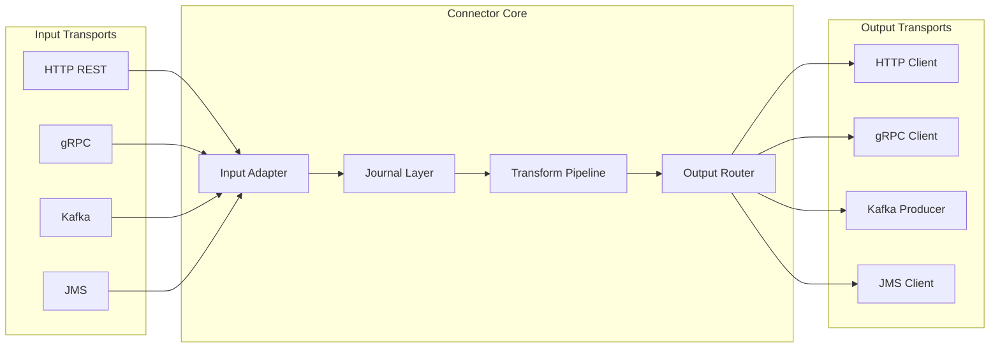

# Payment Connector Framework – Plan

## Tech stack and baseline

- **Java 21**, **Spring Boot 3.3.x or 3.4.x** (latest 3.x)
- **Build**: Gradle 9.x (multi-module, Kotlin DSL); see [Build management and configuration (Gradle 9.x)](#build-management-and-configuration-gradle-9x) below.
- **Virtual threads**: `spring.threads.virtual.enabled=true` for IO-bound scaling
- **Observability**: OpenTelemetry (SDK + instrumentation for tracing and metrics)
- **Resilience**: Resilience4j (retries, bulkhead, rate limiter, circuit breaker)
- **Journal**: RDBMS via **Spring JDBC** and **native SQL** (no JPA); schema and all access use `JdbcTemplate` (or `NamedParameterJdbcTemplate`) with explicit DDL/DML for request/response and status

---

## Library vs Spring Boot starter – recommendation

**Recommendation: Hybrid – core as library + optional starter.**

| Aspect                  | Pure library                     | Pure starter                      | Hybrid (recommended)                                                       |
| ----------------------- | -------------------------------- | --------------------------------- | -------------------------------------------------------------------------- |
| **Control**             | Full; user wires everything      | Convention-heavy; less visibility | Core API is explicit; starter only for "add dependency and configure"      |
| **Testability**         | Easy to unit-test without Spring | Tied to Spring context            | Same as library for core; integration tests with starter                   |
| **Optional transports** | User brings HTTP/Kafka/etc.      | Starter often pulls many deps     | Starter uses `@ConditionalOnClass` so only chosen transports load          |
| **Upgrades**            | User picks Spring version        | Starter pins Boot version         | Starter can track Boot; core stays minimal                                 |
| **Adoption**            | More boilerplate                 | Minimal config                    | One dependency (starter) for default experience; library for custom setups |

**Concrete structure:**

- **Library (core)**: JARs with clear APIs: message model, transport SPI, transformation SPI, journal SPI. No or minimal Spring dependency in the core API (optional Spring support in a small `connector-spring` module for `@Configuration` and `ApplicationContext` integration).
- **Starter**: Single dependency that pulls core + `connector-spring` + optional transport modules based on classpath. Auto-configuration registers servers/clients, health, and Actuator endpoints only when the corresponding dependencies (e.g. Kafka, JMS) are present.

This keeps the framework usable from non-Spring or minimal-Spring environments while giving a "one dependency + config" experience for Spring Boot apps.

---

## High-level architecture

- **Input**: One of the four server types receives a message and passes it to a common **input adapter** that produces a **canonical internal message**.
- **Journal**: Request (and later response) are persisted with a correlation ID and status.
- **Transform**: Pluggable pipeline converts internal model to target format and selects output transport(s).
- **Output**: One of the four client types sends the message; response (if any) is journalled and can be correlated.

---

## Module layout

- **connector-core** – Message model, correlation ID, transport SPI (inbound/outbound), transformation SPI, back-pressure and micro-batch interfaces.
- **connector-journal** – Journal persistence via **Spring JDBC** and **native SQL** (no JPA): DDL scripts for tables, DAO/repository using `JdbcTemplate`; "append and update" API; supports replay and hold/release by correlation ID.
- **connector-transformation** – Default transformation pipeline (chain of converters); registry for "input type → output type" and "transport → transport".
- **connector-servers** – Optional modules:
  - **connector-server-http** – REST controller (or WebFlux), start/stop and health.
  - **connector-server-grpc** – gRPC service, start/stop and health.
  - **connector-server-kafka** – Kafka listener container, start/stop and health.
  - **connector-server-jms** – JMS listener container, start/stop and health.
- **connector-clients** – Optional modules:
  - **connector-client-http**, **connector-client-grpc**, **connector-client-kafka**, **connector-client-jms** with shared resilience (retries, bulkhead, load shedding).
- **connector-observability** – OpenTelemetry tracing and metrics (request, transport, throughput, latencies); optional dependency.
- **connector-spring** – Spring `@Configuration` and beans for core + journal + transformation.
- **connector-spring-boot-starter** – Auto-configuration + Actuator custom health and control endpoints; conditionally enables servers/clients based on classpath.
- **connector-sample-app** (optional) – Single sample app demonstrating HTTP → transform → Kafka (or similar) with journalling and replay.

---

## Core abstractions

**Canonical message (core):**

- `ConnectorMessage`: correlation ID, transport type, payload (e.g. `byte[]` or typed generic), headers/metadata map, timestamp.
- Correlation ID: generated at ingress (or propagated from header) and carried through journal, transform, and egress for tracing and replay.

**Transport SPI (core):**

- `InboundTransport`: `start()`, `stop()`, `isRunning()`, registers a `MessageHandler` (receives `ConnectorMessage`).
- `OutboundTransport`: `send(ConnectorMessage, Map<String,Object>)` returning `CompletableFuture<SendResult>` (or similar) for async and back pressure.
- Each server module implements `InboundTransport`; each client module implements `OutboundTransport`.

**Transformation (connector-transformation):**

- `MessageTransformer<I,O>` or `MessageTransformer<ConnectorMessage, ConnectorMessage>` with optional "input format → internal" and "internal → output format".
- **User-friendly hook**: Single interface, e.g. `ConnectorPipeline` or `MessageConversionRegistry` where user registers:
  - **Input**: "For transport HTTP and content-type X, use `InputConverter<HttpRequest, ConnectorMessage>`."
  - **Output**: "For target transport Kafka and type Y, use `OutputConverter<ConnectorMessage, ProducerRecord>`" (or equivalent).
- Pipeline: receive → input convert → journal (request) → transform (user logic) → output convert → send → journal (response). Keep one canonical internal model to avoid N×M converters.

**Micro-batching:**

- For Kafka/JMS consumers: accumulate messages in a bounded buffer (e.g. size 32 or time window 50 ms); process batch through the same pipeline; use virtual threads or a small pool for batch processing to apply back pressure (block when buffer full) and improve throughput.

---

## Servers: start/stop and health (Actuator)

- **Start/stop**: Each server module's `InboundTransport` is wrapped in a **controllable** component that delegates to the underlying container (e.g. `KafkaListenerEndpointRegistry`, JMS listener lifecycle, embedded gRPC server, or a custom HTTP dispatcher). Expose:
  - Custom Actuator endpoints, e.g. `GET/POST /actuator/connector/servers/{transport}/stop` and `.../start`, or a single `ConnectorControlEndpoint` that lists all transports and allows start/stop by name.
- **Health**: Each server contributes a health indicator (e.g. `ConnectorHttpServerHealthIndicator`) that checks "listener is started and (if applicable) connected." Register these under a single **composite** health indicator, e.g. `connectorServers`, and expose via `GET /actuator/health` (and optionally `actuator/health/connectorServers`). Use `@ConditionalOnClass` so only loaded transports register.

---

## Clients: resilience and back pressure

- **Retries**: Resilience4j `Retry` per outbound call (with backoff); idempotency considerations for payment (e.g. optional idempotency key header).
- **Bulkheading**: Separate thread pool or semaphore per client type (or per destination) so one slow transport does not starve others; with virtual threads, use semaphores or limited `ExecutorService` for outbound calls.
- **Load shedding**: Rate limiter (Resilience4j) or max concurrency cap on outbound; when limit reached, fail fast or buffer in a bounded queue (with timeout) and expose metric "shedded" for observability.
- **Back pressure**: Bounded buffers for micro-batches; outbound `send` returns `CompletableFuture`; do not accept new input (or slow down) when buffer or downstream is full (e.g. reject with 503 or pause Kafka consumer).

---

## Journalling and replay

- **Persistence**: **Spring JDBC only** (no JPA). Use **native SQL** for all access: `JdbcTemplate` or `NamedParameterJdbcTemplate` for inserts, updates, and selects. Schema managed via **DDL scripts** (e.g. `schema.sql` or Flyway/Liquibase with plain SQL) so the same queries work across supported RDBMS (dialect-specific scripts if needed).
- **Schema (RDBMS)**: Tables such as `connector_journal` (id, correlation_id, direction [request/response], transport, payload_type, payload_blob, headers_json, status, created_at, processed_at, error_message). Optional `connector_hold` (correlation_id, held_until, reason) for "store and release later." All CRUD via **parameterised native queries** (e.g. `INSERT INTO connector_journal (...) VALUES (?, ?, ...)`) to avoid ORM overhead and keep full control over SQL.
- **Flow**: On request: persist with status `RECEIVED`; after transform/send: update or append response row with status `SENT`/`FAILED`. Optional: store response body for debugging.
- **Replay**: Endpoint or admin API "replay by correlation_id": read request row with a native `SELECT`, re-run through transformation and outbound send (idempotency where applicable). "Hold and release": mark as held via `UPDATE`; a scheduled job or endpoint "release" processes held items after `held_until` (or on demand).
- **Simplicity**: Single journal table (or request/response split) with clear status enum; index on `correlation_id` and `created_at` for query and cleanup policies. No entities or repositories beyond plain Java types and JDBC row mapping (e.g. `RowMapper`).

---

## Observability (OpenTelemetry)

- **Tracing**: One span per incoming request (with correlation_id in attributes); child spans for "transform" and "send" per transport; propagate context to clients (HTTP headers, gRPC metadata, Kafka headers).
- **Metrics**: Counters for received/sent/failed per transport; throughput (messages/sec); histograms for latency (receive → ack, transform duration, send duration). Classify by transport and optionally by message type or endpoint.
- **Integration**: Use OpenTelemetry Java agent or Spring Boot's OTel starter; add custom spans and metrics in adapter and client code. Expose metrics to Prometheus and traces to Jaeger/OTLP as per standard Spring/OTel setup.

---

## Implementation details to standardise

1. **Virtual threads**: Enable via `spring.threads.virtual.enabled=true` in sample and docs; use for HTTP/gRPC server handling and for async outbound (e.g. `ExecutorService.newVirtualThreadPerTaskExecutor()` for client calls) where appropriate.
2. **Correlation ID**: Generated at first touch (or from `X-Correlation-ID` / gRPC metadata / Kafka header); inject into `ConnectorMessage` and into all logs and spans.
3. **Error handling**: Failed messages update journal status to `FAILED` and optionally go to a DLQ or dead-letter table; retries and circuit breaker prevent cascade failures.
4. **Configuration**: Per-transport YAML/properties (e.g. `connector.servers.kafka.enabled`, `connector.clients.http.foo.url`, resilience and batch size); validation at startup.

---

## Testing with Spock and 90% code coverage

**Test framework:** [Spock](https://spockframework.org/) (Groovy-based) for all unit and integration tests. Use **Spock 2.x** (JUnit 4/5 compatible); with Spring Boot 3.x, use the JUnit 5 engine (`spock-junit4` or `spock-spring` with JUnit 5).

**Coverage target:** **90%** (line or instruction coverage) enforced in CI. Use **JaCoCo** (Maven/Gradle plugin) with a minimum coverage ratio; fail the build if any module falls below 90%.

**Test layout per module:**

- **Unit tests**: One Spock spec per production class (or per cohesive group of small classes), in `src/test/groovy` mirroring `src/main/java` package structure. Use `Specification`, `@Subject`, and `given/when/then` (or `expect`) blocks. Mock collaborators with `Mock()`/`Stub()` and verify interactions with `n * collaborator.method(_)`.
- **Integration tests**: Spock specs that load a minimal Spring context (`@SpringBootTest` or `@Import` only the beans under test) or use testcontainers (e.g. Kafka, DB, JMS) for transport and journal modules. Use `@Stepwise` only when order matters.

**What to test and how:**

| Layer                           | Focus                                                                              | Spock usage                                                                                                          |
| ------------------------------- | ---------------------------------------------------------------------------------- | -------------------------------------------------------------------------------------------------------------------- |
| **connector-core**              | Message model, correlation ID generation, transport SPI contracts, pipeline wiring | Unit specs; mock `MessageHandler`/`OutboundTransport`; data-driven tests with `@Unroll` for multiple inputs.         |
| **connector-journal**           | JDBC DAO, append/update, status transitions, replay/hold queries                   | Unit specs with in-memory H2 or Testcontainers; `@SpringBootTest` with `JdbcTemplate` and DDL; no JPA.               |
| **connector-transformation**    | Pipeline execution, converter registry, error paths                                | Unit specs with stub converters; `@Unroll` for "input A → output B" matrices.                                        |
| **connector-servers / clients** | Start/stop, health state, resilience (retries, bulkhead, shed)                     | Unit: mock containers and Resilience4j; integration: embedded/server stubs (e.g. WireMock for HTTP, embedded Kafka). |
| **connector-spring / starter**  | Auto-configuration conditions, bean presence, Actuator endpoints                   | `@SpringBootTest` with `@TestConfiguration` or overrides; assert health and control endpoint behaviour.              |
| **Observability**               | Span creation, metric recording                                                     | Unit: mock OTel API; integration: assert exported spans/metrics in memory or test exporter.                          |

**Coverage tactics to reach 90%:**

- Test **happy path** and **error paths** (e.g. send failure, transform exception, journal write failure).
- Use **data-driven tests** (`@Unroll`) for valid/invalid inputs and boundary cases (empty payload, missing correlation ID).
- Cover **edge cases** in resilience: retry exhaustion, circuit open, bulkhead full, rate limit exceeded.
- Test **lifecycle**: start → process → stop; health down when stopped.
- Exclude from coverage only: DTOs/getters/setters if they are pure data, or explicitly list exclusions in JaCoCo (e.g. `*Application` main class) so core logic stays in scope.

**Build and CI:**

- Add **Groovy** and **Spock** dependencies via Gradle (see [Build management and configuration (Gradle 9.x)](#build-management-and-configuration-gradle-9x)) with `testImplementation` scope.
- Configure **JaCoCo** in Gradle with 90% minimum; optionally aggregate multi-module report.
- Run tests in CI; gate merge on tests passing and coverage ≥ 90%.

---

## Build management and configuration (Gradle 9.x)

**Gradle version:** **9.x** (e.g. 9.1+ or current 9.3.x). Use **Kotlin DSL** (`build.gradle.kts`, `settings.gradle.kts`) for type-safe, IDE-friendly build scripts.

**Root layout:**

- **settings.gradle.kts**: Set `rootProject.name`; `include(...)` all modules (e.g. connector-core, connector-journal, connector-transformation, connector-server-*, connector-client-*, connector-observability, connector-spring, connector-spring-boot-starter, connector-sample-app). Use a **version catalog** (optional but recommended) via `gradle/libs.versions.toml` for centralised dependency versions.
- **Root build.gradle.kts**: Apply common plugins and conventions via `subprojects { ... }` or a **convention plugin** (e.g. `buildSrc` or `gradle/convention-plugins`) so every module gets Java 21, Spring Boot (where applicable), test dependencies (Spock, Groovy), and JaCoCo with 90% minimum coverage.

**Convention and configuration:**

- **Java 21**: Set `JavaLanguageVersion.of(21)` in a shared `JavaPluginExtension` or convention plugin; ensure `sourceCompatibility` / `targetCompatibility` align.
- **Spring Boot**: Apply `org.springframework.boot` and `io.spring.dependency-management` in modules that are Boot apps or depend on Boot; use **dependency management** (BOM) so versions are consistent. Starter and sample-app are Boot projects; core/journal/transformation are plain libraries with optional Spring dependencies.
- **Version catalog** (`libs.versions.toml`): Define aliases for Spring Boot, **spring-jdbc** (for connector-journal; do not use spring-boot-starter-data-jpa), Resilience4j, OpenTelemetry, gRPC, Kafka, JMS, Spock, Groovy, JaCoCo, etc.; reference in subprojects as `libs.xxx`.
- **Optional modules**: Transport modules can use optional dependencies or `api`/`implementation` so the starter does not force all transports; document which dependencies to add for HTTP/gRPC/Kafka/JMS.

**Testing and coverage (Gradle):**

- **Spock / Groovy**: Add `org.spockframework:spock-core` and Groovy (e.g. `org.apache.groovy:groovy`) under `testImplementation`; for Spring integration use `spock-spring` and JUnit 5 engine. Place Spock specs in `src/test/groovy` and ensure `test` source set includes Groovy.
- **JaCoCo**: Apply `jacoco` plugin in each module (or via convention plugin); set `minimumFraction` (or equivalent) to `0.90` and fail the build on coverage below 90%. Use **JaCoCo report aggregation** (root project or a dedicated `jacoco-report` subproject) to produce a single HTML report across all modules if desired.
- **Test tasks**: Use default `test` task; enable **configuration cache** where possible (Gradle 9.x supports it) for faster builds.

**Configuration cache and performance:**

- Prefer **configuration cache**-friendly patterns (avoid reading external files or env in configuration phase where it breaks cache); document any opt-out if a plugin is not yet compatible.
- Use **dependency verification** (signing/verification) if required for security.

**Summary of key files:**

- `settings.gradle.kts`: root name + `include` of all connector modules.
- `gradle/libs.versions.toml`: (optional) version catalog.
- Root `build.gradle.kts`: common plugins, Java 21, convention for tests and JaCoCo.
- Per-module `build.gradle.kts`: dependencies (from catalog or explicit), apply Spring Boot only where needed.

---

## Suggested implementation order

1. **Gradle 9.x build**: Create root and module structure with `settings.gradle.kts` and Kotlin DSL; add version catalog, Java 21, convention for tests and JaCoCo; apply Spring Boot only in starter and sample-app.
2. **connector-core**: Message model, correlation ID, `InboundTransport`/`OutboundTransport` SPI, and a simple in-memory or no-op journal interface.
3. **connector-journal**: RDBMS via **Spring JDBC** and **native SQL**: DDL scripts for journal (and hold) tables, DAO using `JdbcTemplate`/`NamedParameterJdbcTemplate` with parameterised queries; integrate "append request" and "update response" into the pipeline. No JPA dependencies.
4. **connector-transformation**: Pipeline and registry; input/output converters and one example (e.g. JSON → internal → JSON).
5. **connector-server-http** and **connector-client-http**: First server and first client with start/stop and health; wire resilience on client.
6. **connector-observability**: OpenTelemetry tracing and metrics in core pipeline and one server/client.
7. **connector-server-grpc**, **connector-server-kafka**, **connector-server-jms** and corresponding clients: Same patterns as HTTP; shared resilience and health.
8. **connector-spring** and **connector-spring-boot-starter**: Auto-configuration and Actuator control/health endpoints; conditional beans.
9. **Replay and hold/release**: Journal-based replay API and hold/release semantics.
10. **Micro-batching and back pressure**: Bounded buffers and batch processing for Kafka/JMS consumers; document back-pressure behaviour.
11. **connector-sample-app**: End-to-end app with one server, transformation, one client, journalling, and replay.
12. **Spock tests and 90% coverage**: For each module above, add Spock unit and (where needed) integration specs; configure JaCoCo with 90% minimum and enforce in CI.

This keeps the design simple, transport-agnostic, and observable, with a clear path to a user-friendly Spring Boot experience via the starter while keeping the core usable as a library.
